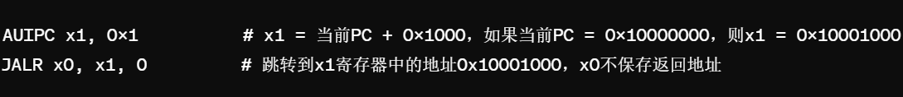



**some images is captured from Macau University of Science and Technology CS230 course**

    

        <strong>Contents</strong>
        <ul>
            <li><a href="#l4-isa">L4: ISA</a></li>
            <li><a href="#l6-pipeline">L6: Pipeline</a></li>
            <li><a href="#l7-cache">L7: Cache</a></li>
        </ul>
    

# L4: ISA

## Review:
In the past lectures, we have learned how to ***represent
data*** and perform concrete ***arithmetic
operations*** on data.
So the next problem is How to ***locate these data*** to
be processed, and how to tell the computer the ***concrete
operations*** to be applied on these data?
## Problem:
1.  **Find where the data is**
2.  **"Tell" the computer the specific operations on these data**

## Concepts of ISA:
An instruction tells a computer to perform a specific operation, and it comprises of multiple binary fields.

**According to the previous question, an instruction needs to have two functions:**
> - 1. Tell the computer what to do
> - 2. What data to operate on?

**Operands:** the data to be operated.
> -Source operands
>
> -Destination operands

**Opcodes:** the operation to be applied on the operand.

## An ISA (or architecture) includes:
1.  A set of instructions.
2.  A set of programmer visible properties (registers, memory addressing, memory model, I/O, interruption/exception)

## Three types of instruction:
1.  Computational instruction(Reg-Reg, also called ALU(arithmetic logic unit))
2.  Data movement(e.g. load instruction(LW), store instruction(SW)), **(load instruction)** Transfer data from memory to a register (register). Since register access is much faster than memory, data usually needs to be loaded into a register before calculations are performed.
3.  Control flow(e.g. Conditional branch, Unconditional jump, Procedure call/return), **Control flow instructions determine what the next instruction in the program executes.** The destination to which it jumps corresponds to another process, and when the called process (callee) completes, it must return to the calling process (caller).
    
## Program Counter(PC):
1.  A special register
2.  It is used to track the location of the current instruction being executed by the processor.
    In a 32-bit system, the PC can address 2\^32 different byte addresses, allowing direct access to 4GB of memory space. In a 64-bit system, it can access more memory space.
    In the design of the ISA, the position of the operands is **consistent** across various instruction formats. This means that regardless of whether an arithmetic instruction, a logical instruction, or some other type of instruction is executed, the position of the operands in the instruction (i.e., the bit fields in the encoding) are the same. This design has two main benefits:
      1.  Simplify circuit(Simplify the circuit and do not require special processing of different instruction formats to extract operands)
      2.  Enable fetch easy

Instruction set:
    
## RISC-V
RISC-V is an instruction set architecture (ISA) for developing source code and is a learning tool used in the CS320 course.
For RV32I, there are only 32 32-bit registers (RV64 has 32 64-bit registers).
General Purpose Register (GPR) general purpose register

## Program execution steps:

## RISC-V Instruction Formats

Combining the Instruction set and the RISC-V instruction format, it can be seen that the Opcode of the specific operations under each type is the same (except for U-Type and J-Type, U-Type two operations: LIU and AUIPC require more bits of immediate data imm\[31:12\], distinguished by Opcode, J-Type only has JAL), while other types of different operations rely on func3 to distinguish (except R-Type, func3 only has 3-bit, representing up to 8 different operations, and R-Type has 10 operations, so an additional func7 (7-bit) is needed to distinguish).
There are several basic formats of RISC-V instructions, each designed to meet the needs of different types of operations. These formats include:

I will not illustrate all semantics of operations, I just explain some complex semantics, the viewer can check rest in PowerPoint of lecture.

1.  **<u> R-Type: used for arithmetic and logical operations between registers </U>**

    Reg-Reg operations perform data processing directly between registers and do not involve immediate data or memory access.
    
    1. **ADD: Add the values of two registers. **
    2. **SUB: Subtract the value of one register from the value of another register. **
    3. **AND: Performs a bitwise AND (AND) operation between two register values. **
    4. **OR: Perform a bitwise OR (OR) operation between two register values. **
    5. **XOR: Perform a bitwise exclusive OR (XOR) operation between two register values. **
    6. **SLT (Set Less Than): If the value in one register is less than the value in another register, write 1 to the destination register, otherwise write 0. **
        1.  **SLT rd, rs1, rs2**
            1.  **rs1 \< rs2 ? GPR(rd)=1 : GPR(rd)=0
                如果寄存器rs1中的值小于寄存器rs2中的值，那么目的寄存器rd被设置为1，否则设置为0。 均为有符号数比较 **
    7.  **SLL(Shift Left Logical):逻辑左移 ，将一个寄存器的值向左移动指定的位数，右边空出的位用0填充。**
2.  **<u> I型: 单个寄存器与立即数之间的操作 </u>**

    有的**I-Type**操作没有立即数，有立即数的**I-Type**操作位数是12，imm[11:0]
   
    1.  **JALR(Jump and Link Register):无条件跳转到由基址寄存器和立即数偏移量确定的地址，同时将下一条指令的地址保存到目的寄存器。常用于实现函数返回。**
        1.  **JALR rd, rs1, imm12**
            1.  **Target=GPR(rs1)+sign-extend(imm12)#计算跳转目标地址**
            2.  **Target&=0xFFFFFFFE#按位与(AND)操作清除目标地址最低位，确保地址按2的倍数对齐  地址对齐 **
            3.  **GPR(rd)=PC+4#保存跳转指令的后一条指令**
            4.  **PC\<\--Target#实现无条件跳转**
    2.  **LB(Load Byte):从内存加载一个字节，并符号扩展到32位，然后存入目的寄存器。**
        1.  **LB rd, offset(rs1)]**
            1.  **MemoryAddress=GPR(rs1)+sign-extend(offset)**
            2.  **从计算出的MemoryAddress处加载一个字节。**
            3.  **将这个字节符号扩展到32位或64位(取决于寄存器的位宽)**
            4.  **最后，将扩展后的值存入目的寄存器rd中。**
    3.  **LH(Load Half-word):从内存加载半字(两个字节)，并符号扩展到32位，然后存入目的寄存器。**
    4.  **LBU(Load Byte Unsigned):从内存加载一个字节，但不进行符号扩展(即零扩展到32位)，然后存入目的寄存器。**
    5.  **LHU(Load Half-word Unsigned):从内存加载半字(两个字节)，但不进行符号扩展(即零扩展到32位)，然后存入目的寄存器。**
    6.  **SLTI(Set Less Than Immediate):将源寄存器的值与立即数比较，如果源寄存器的值小于立即数，则目的寄存器设为1，否则设为0。**
    7.  **SLTIU(Set Less Than Immediate Unsigned):无符号比较版本的SLTI，将源寄存器的值与 进行符号位扩展后的立即数比较 ，比较时 均视为无符号数 。**
    8.  **XORI(XOR Immediate):执行源寄存器的值与立即数的异或(XOR)操作，并将结果(0/1)存入目的寄存器。**
    9.  **[ORI(OR Immediate):执行源寄存器的值与立即数的逻辑或操作，并将结果存入目的寄存器(rd)。**
    10. **SRLI(Shift Right Logical Immediate):将源寄存器的值逻辑右移指定的位数(由立即数给出)，并将结果存入目的寄存器。**
    11. **SRAI(Shift Right Arithmetic Immediate):将源寄存器的值算术右移指定的位数(由立即数给出)，并将结果存入目的寄存器。算术右移会保留符号位。**
    12. **LW(Load Word):从内存中加载一个字到寄存器。**
    13. **[ADDI(Add Immediate):将源寄存器的值与立即数相加。**
    14. **ANDI(AND Immediate):执行源寄存器的值与立即数的逻辑与操作。**
    15. **SLLl(Shift Left Logical Immdiate):将源寄存器的值向左逻辑移指定的位。**
    16. **CSR(Control and Status Register)访问指令:用于读取和修改控制和状态寄存器的值。控制和状态寄存器。**

3. **<u> S型: 存储数据到内存 </u>**

    S型操作的立即数需要重新组合，在其他的类型是rd(目标寄存器)的位置，S型操作在该位置是imm\[4:0\]，instr\[31:25\]是imm\[11:5\]。**12位立即数**

    1.  **SB(Store Byte):存储一个字节到内存。**
    2.  **SH(Store Half word):存储半字(2字节)到内存。**
    3.  **SW(Store Word):存储一个字(4字节)到内存。**
4.  **<u> B型: 条件分支操作 </u>**

    根据寄存器之间的比较结果来决定是否跳转到程序中的另一个位置。
    
     **B-Type默认imm\[0\]=0**  **B-Type** 有13位立即数
    1.  **BEQ(Branch if Equal):如果两个寄存器的值相等，则跳转。**
    2.  **BNE(Branch if Not Equal):如果两个寄存器的值不相等，则跳转。**
    3.  **BLT(Branch if Less Than)):如果第一个寄存器的值小于第二个寄存器的值(有符号比较)，则跳转。**
    4.  **BGE(Branch if Greater or Equal):如果第一个寄存器的值大于等于第二个寄存器的值(有符号比较)，则跳转。**
    5.  **BLTU(Branch if Less Than Unsigned):无符号比较版本的BLT。**
    6.  **BGEU(Branch if Greater or Equal Unsigned):无符号比较版本的BGE。**
5.  **<u> U型: 加载大的立即数到寄存器 </u>**

    通过观察其他类型格式可以发现，U型指令将32位指令空间中的20位(imm\[31:12\])用于立即数，这使得它们可以用于构建大的常数或者作为跳转和其他指令的基地址。

    1.  **LIU:加载上位立即数:20位立即数，这部分立即数在执行LUI时直接加载到目标寄存器的高20位剩下的12位清零。**
    2.  **AUIPC:添加立即数到PC:将20位立即数左移12位(也就是说，将其作为高20位)，然后将结果加到当前PC值上，结果存储在目的寄存器中。**
6.  **<u> J型: 无条件跳转操作 </u>**

    JAL指令格式中立即数(imm20)部分并非按照指令给定的顺序，具体顺序可见Instruction set，有**20位立即数**
    
    1.  **JAL(Jump and Link):无条件跳转到程序指定的位置，同时将JAL的下一条指令保存到rd寄存器中。**
        1.  **JAL rd, imm21 imm21\[0\]=0**
            1.  **Target=PC+sign-extend(imm21)**
            2.  **GPR(rd)=PC+4**
            3.  **PC\<\--Target**
 每种格式都固定为32位长度，**不同之处在于操作码、寄存器地址和立即数字段的分配方式。**

 **逻辑移位与算术移位：** 
 
 逻辑移位将二进制数的所有位向左或向右移动指定的位数，移入的位置用0填充。

 **逻辑左移(Shift Left Logical,SLL):** 
 
 向左移位时，最左边的位被移出，并且在最右边移入0。每向左移动一位，相当于乘以2。
 
 **逻辑右移(Shift Right Logical,SRL):** 
 
 向右移位时，最右边的位被移出，并且在最左边移入0。每向右移动一位，相当于除以2，但不保留余数。
 
 **算术左移(Shift Left Arithmetic,SLA):** 
 
 与逻辑左移相同，因为对于有符号数和无符号数而言左移的效果是一致的，即乘以2，最右边移入0。
 
 **算术右移(Shift Right Arithmetic,SRA):** 
 
向右移位时，最右边的位被移出，但最左边移入的是原来最左边的位的值(即符号位的值)，这保持了数的符号不变。对于负数(通常用补码表示)，这意味着在最左边移入1;对于正数，则移入0。
 
 **地址对齐：** 
 
 内存地址对齐是计算机在内存中的数据排列、访问数据的方式，包含了**基本数据对齐**和**结构体数据对齐**的两种相互独立又相互关联的部分。现代计算机在内存中读写数据是按**字节块**进行操作，理论上任意类型的变量访问可以从任何地址开始，但是计算机系统对任意数据类型在内存中存放位置有限，它会要求这些数据的首地址的值为K(4位或者8位)的整数倍。
 
  如在32位操作系统中，数据总线宽度32，每次读取4字节，地址总线宽度为32，故最大寻址空间为2^32=4GB，但是最低位A\[0\]、A\[1\]不用寻址，A\[2\]、A\[3\]才能与存储器相连，总的寻址位还是2^30=4GB。在内存中存放的基本数据类型的首地址的最低两位都是0(结构体中的成员变量除外)。
  
  **基本类型数据对齐** 是数据在内存中的偏移地址必须为一个字的整数倍，这种存储数据的方式，可以提升系统在读取数据时的性能。
  在结构体中为了对齐数据，可能必须在上一个数据结束和下一个数据开始的地方填充一些不必要的字节。
  
## Different Pairing with JALR
 
 *<u> 与LUI配合: </u>* 实现对任意32位绝对地址的跳转。
 
 *<u> 与AUIPC配合: </u>* 实现对任意32位PC相对地址的跳转。
 
 **JALR与LUI指令配合使用：**
 LUI指令用于将一个20位的立即数加载到寄存器的高20位，同时将低12位置零。这允许我们设置寄存器中几乎任何32位值的高部分。
 当与JALR指令配合使用时，你首先可以使用LUI指令将目标地址的高20位设置到某个寄存器(比如rs1)，接着使用JALR指令，通过添加一个相对小的偏移量(12位立即数)，跳转到整个32位地址空间内几乎任意的绝对地址。这种方法允许程序跳转到32位地址空间内的任意位置。
 
 **JALR与AUIPC指令配合使用：**
   AUIPC指令用于将20位的立即数左移12位(形成高20位立即数)，加上当前PC值，结果存入指定寄存器。这样，我们可以得到一个相对于当前PC的偏移地址。当与JALR指令配合使用时，首先可以使用AUIPC指令计算出一个基于当前PC的偏移目标地址并将该地址存入寄存器。然后，通过JALR指令跳转到这个寄存器指定的地址，可以是程序内存空间内相对于当前PC的任意位置。这种方法适用于实现基于PC的相对跳转，特别是在处理大范围内的跳转时非常有效。
   
 举个例子：
 假设我们想要跳转到绝对地址0x12345678。这个地址超出了JALR指令直接指定的立即数偏移量范围，但我们可以先用LUI和一个立即操作来设置这个地址。

 首先使用LUI将目标地址的高20位加载到寄存器\`x1·中，然后使用ADDI指令添加剩余的低12位。最后，使用JALR指令无条件跳转到这个地址。
 
 假设我们现在的PC地址为0x10000000我们想要跳转到当前PC地址向前(或向后)某个偏移量的位置，例如0x10001000
 AUIPC指令将当前PC的值(假设为0x10000000)加上0x1000(因为立即数被左移了12位)，计算出新的地址并存入x1。然后，JALR指令使用x1寄存器的值作为跳转地址，实现了相对于当前PC的跳转。

## RISC-V Register Usage Convention：
 

 **RISC-V有32个通用寄存器(GPR)，每个寄存器与处理器位宽相同。**

 * x0:硬编码为0，任何对x0的写操作都会被忽略，读取x0总是返回0。
 * x1(ra):返回地址寄存器，用于存储跳转指令(如JAL、JALR)的返回地址。
 * x2(sp):堆栈指针寄存器用于指向当前的堆栈顶部。
 * x3 (gp):全局指针寄存器，用于访问全局变量。
 * x4(tp):线程指针寄存器，用于多线程环境下的线程局部存储,
 * x5-x7(t0-t2):临时寄存器，用于保存临时数据。
 * x8(s0/fp):保存寄存器或帧指针寄存器，用于保存调用者的帧指针或作为保存寄存器。
 * x9(s1):保存寄存器，用于保存调用者保存的值。
 * x10-x11(a0-a1):函数参数寄存器，用于传递函数的前两个整数参数，或传递函数的返回值。
 * x12-x17(a2-a7):更多的函数参数寄存器，用于传递额外的函数参数。
 * x18-x27(s2-s11):更多的保存寄存器，用于保存调用者保存的值。
 * x28-x31(t3-t6):更多的临时寄存器，用于保存临时数据。

**s0-s11(saved register):**

如果一个被调用的函数(callee)打算使用这些寄存器，它必须先将原来的值保存到栈上(或其他安全的地方)，然后在函数返回前恢复这些寄存器的原始值。这样做是为了保证调用者(caller)在函数调用返回后，可以安全地继续使用这些寄存器中的数据，因为它们的值在调用期间不会被改变。

**t0-t6(temporary register):**

关于t寄存器(t0到t6)，这些是临时寄存器。它们不需要被调用的函数(callee)保存和恢复。换句话说，callee函数可以自由地使用这些寄存器，而不需要担心会干扰到调用者(caller)。

但是，如果caller函数在调用返回后仍然需要这些寄存器中的值，那么它需要在调用callee函数之前自行保存这些寄存器的值，并在调用返回后恢复它们。

## Memory Usage Convention:

**1.数据对齐**

数据对齐约定规定了不同类型的数据应如何在内存中对齐，以确保最佳的访问性能。例如，某些体系结构要求4字节整数必须在4字节对齐的地址上存储。

**2.栈的使用**

栈通常用于管理函数调用时的**局部变量**、返回地址和函数参数。约定会规定栈的增长方向(向上增长或向下增长)、如何在函数调用过程中在栈上分配空间等。

**3.堆的使用**

dynamic又称heap，动态内存分配(malloc)通常从堆区域进行。内存使用约定会涉及如何请求和释放堆内存、堆内存的组织方式(如使用哪种类型的内存分配算法)等。

**4.全局与静态存储区域**

这些区域用于存储程序的全局变量和静态变量。约定会规定这些变量的存储位置和生命周期。

**5.文字和常量数据**

程序中的常量数据(如字符串字面量和其他固定值)通常存储在专门的只读内存区域中。约定会指明这些数据的存储方式和位置。

**6.代码区域**

这是程序的机器代码存储的位置。在某些系统中，代码区域可能被设置为只读，以防止程序在运行时被修改。

## RISC-V properties:

## Rule-of-thumb(经验法则)

**应由最不可能使用寄存器的一方(调用者或被调用者)来保存寄存器：** 这意味着如果一个寄存器在函数调用过程中不太可能被一方使用，那么这一方应该负责保存和恢复该寄存器的原始状态。这样做的目的是最小化寄存器保存和恢复的开销，从而优化程序的性能。

**参数寄存器(如a0,a1等)的保存者应该是调用者。** 这是因为被调用者(callee)很可能会在其算术逻辑单元(ALU)指令中使用这些寄存器作为目的寄存器(rd)，而调用者在调用完成后可能不再需要这些参数寄存器。因此，由调用者保存这些寄存器可以减少不必要的保存和恢复操作，因为被调用者可能会修改它们。

**返回地址寄存器(ra，即x1)的保存者是调用者。** 这不是基于上述经验法则的直接应用，而是因为调用者知道跳转并链接指令(JAL)会修改返回地址寄存器(ra)，而且在返回时需要使用它。因此，调用者负责保存和恢复ra寄存器，以确保函数返回后能够正确地回到调用点。

## Basic Calling Convention

# L6: Pipeline(流水线)

# L7: Cache(缓存)

## What is Cache

**Cache**: A **smaller, faster** storage device for temporarily holding a subset of data from a larger, slower device.

For computers, cache is a small SRAM(静态随机访问存储器) storage between the CPU and the main memory(DRAM(动态随机访问存储器))

## Why we need an additional storage device

When a program accesses main memory(DRAM), the latency is much higher relative to accessing registers or caches inside the CPU. As an intermediate storage layer between the CPU and main memory, the cache can store the most frequently used data and instructions, thereby significantly reducing the processor's waiting time when accessing these data.

**we need create a memory with these properties**
>- Faster
>- smaller
>- cheaper

## Principle of Locality

Programs tend to use data and instructions with addresses near or equal to those they have used recently

> - Temporal Locality
> -     Recently referenced items are likely to be referenced again in the near future
> - Spatial Locality
> -     Items with nearby addresses tend to be referenced close together in time

