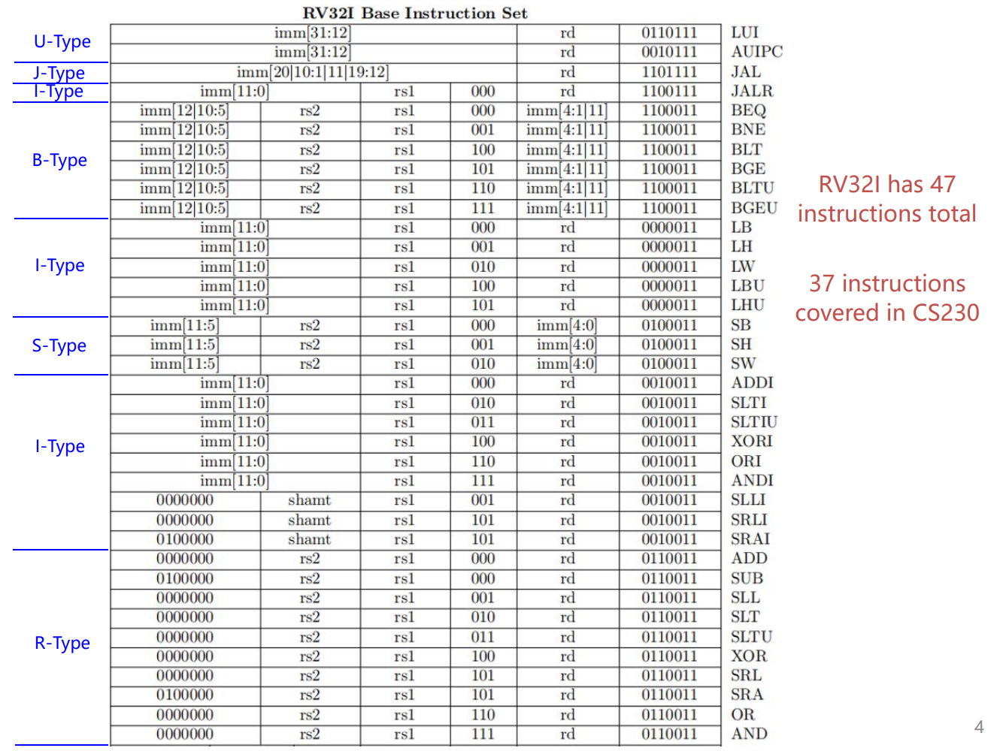
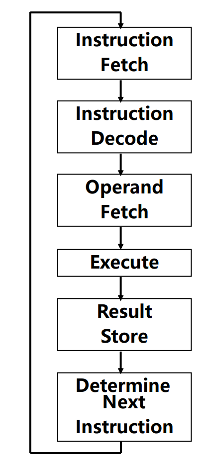
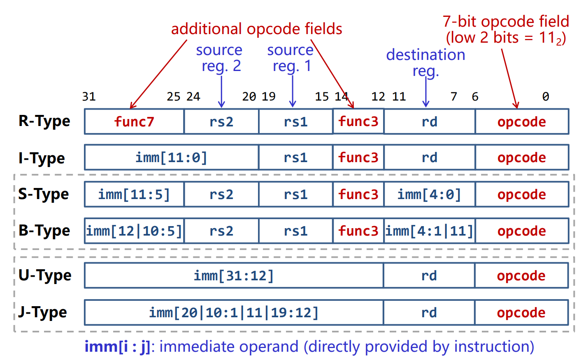
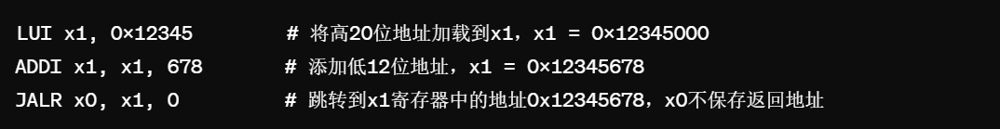
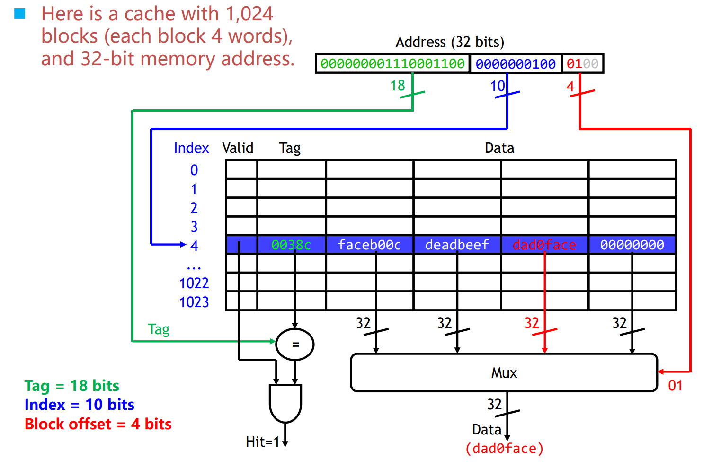



**some images is captured from Macau University of Science and Technology CS230 course**

    <button id="toc-toggle" onclick="toggleTOC()">目录</button>
    

        <strong>Contents</strong>
        <ul>
            <li><a href="#l2-data-representation">L2: Data Representation</a></li>
            <li><a href="#l3-computer-arithmetic">L3: Computer Arithmetic</a></li>
            <li><a href="#l4-isa">L4: ISA</a></li>
            <li><a href="#l6-pipeline">L6: Pipeline</a></li>
            <li><a href="#l7-cache">L7: Cache</a></li>
        </ul>
    

# L2: Data Representation
## 进制
二进制(binary), 八进制(Octal), 十进制(decimal), 十六进制(hexadecimal)
## 进制之间的相互转换
4位二进制数代表1位十六进制数，2位十六进制数代表1 byte(字节)，1个字(word)代表4个字节(byte)
## 字节的存储顺序(endianness)

**Little Endianness**：将字节的**低位**存储在内存地址中的低位。

**Big Endianness**：将字节的**高位**存储在内存地址中的低位。
## 有符号数表示
**2's complement**：取反后+1

5：0101

"0101"取反："1010"

"1010"+1："1011"

-5：1011
## 浮点数表示
**Floating-point standardization: IEEE 754**

**single precision**：S(1 bit), E(8 bit), M(23 bit). total: 32 bit->转换为16进制应有8位

**double precision**：S(1 bit), E(11 bit), M(52 bit), total: 64 bit->转换为16进制应有16位

**S**是符号位，0表示正数，1表示负数

**E**=exponent+bias

**exponent**是需要表示的数转化成二进制的科学计数法后的指数大小

**bias**在single precision下，大小是27-1=127

**M**=Mantissa-1
## Range the IEEE 754 can represent
(+1.8×10-38, +3.4×1038) and (-3.4×1038, -1.8×10-38)

# L3: Computer Arithmetic
## Binary Adder
**加法：X+Y**

**减法：X-Y**等价于**X+(inverse of Y)+1**(2's complement)

**Overflow Problem**

OF=Cn⊕Cn-1

**1-bit binary adder**

**Ci+1=XiYi+(Xi⊕Yi)Ci**

**Si=Xi⊕Yi⊕Ci**

**1-bit binary adder**有5个logic gates

**实现减法**只需要设置C0=1，并将减数与1进行异或操作(inverse of Y)。(2's complement)
## Fast Binary Adder
**Generate**：Gi=XiYi

**Propagate**：Pi=Xi⊕Yi

**Ci+1=Gi+PiCi**
## CLA(Carry Lookahead Logic)
CLA的输入是P和G，输出是C，是用来组合C的对应的P和G

**C1=G1+P1C0**

**C2=G2+P2C1**

**C2=G2+P2G1+P2P1C0**
## n-bits binary adder
**4-bits binary adder**有1个CLA

**16-bits binary adder**有4个CLA

**64-bits binary adder**有21个CLA
## Multiplication and Division
**Multiplication algorithm**

**Booth algorithm**

**Division algorithm**
# L4: ISA

## Review:
In the past lectures, we have learned how to ***represent
data*** and perform concrete ***arithmetic
operations*** on data.
So the next problem is How to ***locate these data*** to
be processed, and how to tell the computer the ***concrete
operations*** to be applied on these data?
## Problem:
1.  **找到数据在哪**
2.  **"告诉"计算机对这些数据的具体操作**

## Concepts of ISA:
An instruction tells a computer to perform a specific operation, and it comprises of multiple binary fields.

**根据前面的问题，一条指令需要有两个功能：**
> - 1. 告诉计算机要进行的操作
> - 2. 要对哪些数据操作

**Operands(操作数):** the data to be operated.
> -Source operands
>
> -Destination operands

**Opcodes(操作码):** the operation to be applied on the operand.

## An ISA (or architecture) includes:
1.  A set of instructions.
2.  A set of programmer visible properties (registers, memory addressing, memory model, I/O, interruption/exception)

## Three types of instruction:
1.  Computational instruction(Reg-Reg, also called ALU(arithmetic logic unit))
2.  Data movement(e.g. load instruction(LW), store instruction(SW)), **加载指令(load instruction)** 将数据从内存传输到寄存器(register)中，由于寄存器访问速度远快于内存，因此通常在进行计算之前，需要先将数据加载到寄存器中。
3.  Control flow 控制流 (e.g. Conditional branch, Unconditional jump, Procedure call/return), **控制流指令决定了程序中下一条指令执行的是什么。** 它跳转到的目的地对应于另一个过程，在被调用过程(被调用者)完成时，它必须 返回到调用过程(调用者).
    
## Program Counter(PC):
1.  A special register
2.  它是用于跟踪处理器正在执行的当前指令的位置 在32位系统中，PC可以寻址2<suo>32个不同的字节地址，允许直接访问4GB的内存空间。而在64位系统中，它能访问的内存空间更多。 在ISA的设计中，操作数的位置在各种指令格式中保持一致性。这意味着无论执行的是算术指令、逻辑指令还是其他类型的指令，指令中操作数的位置(即编码中的位字段)都是相同的。这种设计有两个主要好处:
      1.  Simplify circuit(简化电路，不需要对不同指令格式进行特殊处理来提取操作数)
      2.  Enable fetch easy

Instruction set:
    
## RISC-V
RISC-V是一种开发源代码的指令集架构(ISA)，是CS320课程使用的学习工具。 对于RV32I来说，只有32个32-bit的寄存器(RV64有32个64-bit的寄存器). General Purpose Register(GPR)通用寄存器

## Program execution steps:

## RISC-V Instruction Formats

结合Instruction set和RISC-V指令格式可以看出每个类型下具体操作的Opcode都是一样的(除了U-Type和J-Type，U-Type两个操作：LIU和AUIPC需要更多位立即数imm[31:12]，靠Opcode区分，J-Type只有JAL)，而其他类型的不同操作依靠func3区分(除了R-Type，func3只有3-bit，最多表示8个不同的操作，而R-Type有10个操作，所以需要额外一个func7(7-bit)区分)。 RISC-V指令有几种基本格式，每种格式都是为了满足不同类型操作的需求而设计。这些格式包括:

I will not illustrate all semantics of operations, I just explain some complex semantics, the viewer can check rest in PowerPoint of lecture.

1.  **<u> R-Type: 用于寄存器间的算术和逻辑操作 </U>**

    Reg-Reg操作，直接在寄存器之间进行数据处理，不涉及立即数或内存访问
    
    1. **ADD: 将两个寄存器的值相加。**
    2. **SUB: 从一个寄存器的值中减去另一个寄存器的值。**
    3. **AND: 执行两个寄存器值之间的位与(AND)操作。**
    4. **OR: 执行两个寄存器值之间的位或(OR)操作。**
    5. **XOR: 执行两个寄存器值之间的位异或(XOR)操作。**
    6. **SLT (Set Less Than): 如果一个寄存器中的值小于另一个寄存器中的值，则将1写入目的寄存器，否则写入0。**
        1.  **SLT rd, rs1, rs2**
            1.  **rs1 \< rs2 ? GPR(rd)=1 : GPR(rd)=0
                如果寄存器rs1中的值小于寄存器rs2中的值，那么目的寄存器rd被设置为1，否则设置为0。 均为有符号数比较 **
    7.  **SLL(Shift Left Logical):逻辑左移 ，将一个寄存器的值向左移动指定的位数，右边空出的位用0填充。**
2.  **<u> I-Type: 单个寄存器与立即数之间的操作 </u>**

    有的**I-Type**操作没有立即数，有立即数的**I-Type**操作位数是12，imm[11:0]
   
    1.  **JALR(Jump and Link Register):无条件跳转到由基址寄存器和立即数偏移量确定的地址，同时将下一条指令的地址保存到目的寄存器。常用于实现函数返回。**
        1.  **JALR rd, rs1, imm12**
            1.  **Target=GPR(rs1)+sign-extend(imm12)#计算跳转目标地址**
            2.  **Target&=0xFFFFFFFE#按位与(AND)操作清除目标地址最低位，确保地址按2的倍数对齐  地址对齐 **
            3.  **GPR(rd)=PC+4#保存跳转指令的后一条指令**
            4.  **PC\<\--Target#实现无条件跳转**
    2.  **LB(Load Byte):从内存加载一个字节，并符号扩展到32位，然后存入目的寄存器。**
        1.  **LB rd, offset(rs1)]**
            1.  **MemoryAddress=GPR(rs1)+sign-extend(offset)**
            2.  **从计算出的MemoryAddress处加载一个字节。**
            3.  **将这个字节符号扩展到32位或64位(取决于寄存器的位宽)**
            4.  **最后，将扩展后的值存入目的寄存器rd中。**
    3.  **LH(Load Half-word):从内存加载半字(两个字节)，并符号扩展到32位，然后存入目的寄存器。**
    4.  **LBU(Load Byte Unsigned):从内存加载一个字节，但不进行符号扩展(即零扩展到32位)，然后存入目的寄存器。**
    5.  **LHU(Load Half-word Unsigned):从内存加载半字(两个字节)，但不进行符号扩展(即零扩展到32位)，然后存入目的寄存器。**
    6.  **SLTI(Set Less Than Immediate):将源寄存器的值与立即数比较，如果源寄存器的值小于立即数，则目的寄存器设为1，否则设为0。**
    7.  **SLTIU(Set Less Than Immediate Unsigned):无符号比较版本的SLTI，将源寄存器的值与 进行符号位扩展后的立即数比较 ，比较时 均视为无符号数 。**
    8.  **XORI(XOR Immediate):执行源寄存器的值与立即数的异或(XOR)操作，并将结果(0/1)存入目的寄存器。**
    9.  **[ORI(OR Immediate):执行源寄存器的值与立即数的逻辑或操作，并将结果存入目的寄存器(rd)。**
    10. **SRLI(Shift Right Logical Immediate):将源寄存器的值逻辑右移指定的位数(由立即数给出)，并将结果存入目的寄存器。**
    11. **SRAI(Shift Right Arithmetic Immediate):将源寄存器的值算术右移指定的位数(由立即数给出)，并将结果存入目的寄存器。算术右移会保留符号位。**
    12. **LW(Load Word):从内存中加载一个字到寄存器。**
    13. **[ADDI(Add Immediate):将源寄存器的值与立即数相加。**
    14. **ANDI(AND Immediate):执行源寄存器的值与立即数的逻辑与操作。**
    15. **SLLl(Shift Left Logical Immdiate):将源寄存器的值向左逻辑移指定的位。**
    16. **CSR(Control and Status Register)访问指令:用于读取和修改控制和状态寄存器的值。控制和状态寄存器。**

3. **<u> S-Type: 存储数据到内存 </u>**

    S型操作的立即数需要重新组合，在其他的类型是rd(目标寄存器)的位置，S型操作在该位置是imm\[4:0\]，instr\[31:25\]是imm\[11:5\]。**12位立即数**

    1.  **SB(Store Byte):存储一个字节到内存。**
    2.  **SH(Store Half word):存储半字(2字节)到内存。**
    3.  **SW(Store Word):存储一个字(4字节)到内存。**
4.  **<u> B-Type 条件分支操作 </u>**

    根据寄存器之间的比较结果来决定是否跳转到程序中的另一个位置。
    
     **B-Type默认imm\[0\]=0**  **B-Type** 有13位立即数
    1.  **BEQ(Branch if Equal):如果两个寄存器的值相等，则跳转。**
    2.  **BNE(Branch if Not Equal):如果两个寄存器的值不相等，则跳转。**
    3.  **BLT(Branch if Less Than)):如果第一个寄存器的值小于第二个寄存器的值(有符号比较)，则跳转。**
    4.  **BGE(Branch if Greater or Equal):如果第一个寄存器的值大于等于第二个寄存器的值(有符号比较)，则跳转。**
    5.  **BLTU(Branch if Less Than Unsigned):无符号比较版本的BLT。**
    6.  **BGEU(Branch if Greater or Equal Unsigned):无符号比较版本的BGE。**
5.  **<u> U-Type: 加载大的立即数到寄存器 </u>**

    通过观察其他类型格式可以发现，U型指令将32位指令空间中的20位(imm\[31:12\])用于立即数，这使得它们可以用于构建大的常数或者作为跳转和其他指令的基地址。

    1.  **LIU:加载上位立即数:20位立即数，这部分立即数在执行LUI时直接加载到目标寄存器的高20位剩下的12位清零。**
    2.  **AUIPC:添加立即数到PC:将20位立即数左移12位(也就是说，将其作为高20位)，然后将结果加到当前PC值上，结果存储在目的寄存器中。**
6.  **<u> J-Type: 无条件跳转操作 </u>**

    JAL指令格式中立即数(imm20)部分并非按照指令给定的顺序，具体顺序可见Instruction set，有**20位立即数**
    
    1.  **JAL(Jump and Link):无条件跳转到程序指定的位置，同时将JAL的下一条指令保存到rd寄存器中。**
        1.  **JAL rd, imm21 imm21\[0\]=0**
            1.  **Target=PC+sign-extend(imm21)**
            2.  **GPR(rd)=PC+4**
            3.  **PC\<\--Target**
 每种格式都固定为32位长度，**不同之处在于操作码、寄存器地址和立即数字段的分配方式。**

 **逻辑移位与算术移位：** 
 
 逻辑移位将二进制数的所有位向左或向右移动指定的位数，移入的位置用0填充。

 **逻辑左移(Shift Left Logical,SLL):** 
 
 向左移位时，最左边的位被移出，并且在最右边移入0。每向左移动一位，相当于乘以2。
 
 **逻辑右移(Shift Right Logical,SRL):** 
 
 向右移位时，最右边的位被移出，并且在最左边移入0。每向右移动一位，相当于除以2，但不保留余数。
 
 **算术左移(Shift Left Arithmetic,SLA):** 
 
 与逻辑左移相同，因为对于有符号数和无符号数而言左移的效果是一致的，即乘以2，最右边移入0。
 
 **算术右移(Shift Right Arithmetic,SRA):** 
 
向右移位时，最右边的位被移出，但最左边移入的是原来最左边的位的值(即符号位的值)，这保持了数的符号不变。对于负数(通常用补码表示)，这意味着在最左边移入1;对于正数，则移入0。
 
 **地址对齐：** 
 
 内存地址对齐是计算机在内存中的数据排列、访问数据的方式，包含了**基本数据对齐**和**结构体数据对齐**的两种相互独立又相互关联的部分。现代计算机在内存中读写数据是按**字节块**进行操作，理论上任意类型的变量访问可以从任何地址开始，但是计算机系统对任意数据类型在内存中存放位置有限，它会要求这些数据的首地址的值为K(4位或者8位)的整数倍。
 
  如在32位操作系统中，数据总线宽度32，每次读取4字节，地址总线宽度为32，故最大寻址空间为232=4GB，但是最低位A\[0\]、A\[1\]不用寻址，A\[2\]、A\[3\]才能与存储器相连，总的寻址位还是230=4GB。在内存中存放的基本数据类型的首地址的最低两位都是0(结构体中的成员变量除外)。
  
  **基本类型数据对齐** 是数据在内存中的偏移地址必须为一个字的整数倍，这种存储数据的方式，可以提升系统在读取数据时的性能。
  在结构体中为了对齐数据，可能必须在上一个数据结束和下一个数据开始的地方填充一些不必要的字节。
  
## Different Pairing with JALR
 
 *<u> 与LUI配合: </u>* 实现对任意32位绝对地址的跳转。
 
 *<u> 与AUIPC配合: </u>* 实现对任意32位PC相对地址的跳转。
 
 **JALR与LUI指令配合使用：**
 LUI指令用于将一个20位的立即数加载到寄存器的高20位，同时将低12位置零。这允许我们设置寄存器中几乎任何32位值的高部分。
 当与JALR指令配合使用时，你首先可以使用LUI指令将目标地址的高20位设置到某个寄存器(比如rs1)，接着使用JALR指令，通过添加一个相对小的偏移量(12位立即数)，跳转到整个32位地址空间内几乎任意的绝对地址。这种方法允许程序跳转到32位地址空间内的任意位置。
 
 **JALR与AUIPC指令配合使用：**
   AUIPC指令用于将20位的立即数左移12位(形成高20位立即数)，加上当前PC值，结果存入指定寄存器。这样，我们可以得到一个相对于当前PC的偏移地址。当与JALR指令配合使用时，首先可以使用AUIPC指令计算出一个基于当前PC的偏移目标地址并将该地址存入寄存器。然后，通过JALR指令跳转到这个寄存器指定的地址，可以是程序内存空间内相对于当前PC的任意位置。这种方法适用于实现基于PC的相对跳转，特别是在处理大范围内的跳转时非常有效。
   
 举个例子：
 假设我们想要跳转到绝对地址0x12345678。这个地址超出了JALR指令直接指定的立即数偏移量范围，但我们可以先用LUI和一个立即操作来设置这个地址。

 首先使用LUI将目标地址的高20位加载到寄存器\`x1·中，然后使用ADDI指令添加剩余的低12位。最后，使用JALR指令无条件跳转到这个地址。
 
 假设我们现在的PC地址为0x10000000我们想要跳转到当前PC地址向前(或向后)某个偏移量的位置，例如0x10001000
 AUIPC指令将当前PC的值(假设为0x10000000)加上0x1000(因为立即数被左移了12位)，计算出新的地址并存入x1。然后，JALR指令使用x1寄存器的值作为跳转地址，实现了相对于当前PC的跳转。

## RISC-V Register Usage Convention：
 

 **RISC-V有32个通用寄存器(GPR)，每个寄存器与处理器位宽相同。**

 * x0:硬编码为0，任何对x0的写操作都会被忽略，读取x0总是返回0。
 * x1(ra):返回地址寄存器，用于存储跳转指令(如JAL、JALR)的返回地址。
 * x2(sp):堆栈指针寄存器用于指向当前的堆栈顶部。
 * x3 (gp):全局指针寄存器，用于访问全局变量。
 * x4(tp):线程指针寄存器，用于多线程环境下的线程局部存储,
 * x5-x7(t0-t2):临时寄存器，用于保存临时数据。
 * x8(s0/fp):保存寄存器或帧指针寄存器，用于保存调用者的帧指针或作为保存寄存器。
 * x9(s1):保存寄存器，用于保存调用者保存的值。
 * x10-x11(a0-a1):函数参数寄存器，用于传递函数的前两个整数参数，或传递函数的返回值。
 * x12-x17(a2-a7):更多的函数参数寄存器，用于传递额外的函数参数。
 * x18-x27(s2-s11):更多的保存寄存器，用于保存调用者保存的值。
 * x28-x31(t3-t6):更多的临时寄存器，用于保存临时数据。

**s0-s11(saved register):**

如果一个被调用的函数(callee)打算使用这些寄存器，它必须先将原来的值保存到栈上(或其他安全的地方)，然后在函数返回前恢复这些寄存器的原始值。这样做是为了保证调用者(caller)在函数调用返回后，可以安全地继续使用这些寄存器中的数据，因为它们的值在调用期间不会被改变。

**t0-t6(temporary register):**

关于t寄存器(t0到t6)，这些是临时寄存器。它们不需要被调用的函数(callee)保存和恢复。换句话说，callee函数可以自由地使用这些寄存器，而不需要担心会干扰到调用者(caller)。

但是，如果caller函数在调用返回后仍然需要这些寄存器中的值，那么它需要在调用callee函数之前自行保存这些寄存器的值，并在调用返回后恢复它们。

## Memory Usage Convention:

**1.数据对齐**

数据对齐约定规定了不同类型的数据应如何在内存中对齐，以确保最佳的访问性能。例如，某些体系结构要求4字节整数必须在4字节对齐的地址上存储。

**2.栈的使用**

栈通常用于管理函数调用时的**局部变量**、返回地址和函数参数。约定会规定栈的增长方向(向上增长或向下增长)、如何在函数调用过程中在栈上分配空间等。

**3.堆的使用**

dynamic又称heap，动态内存分配(malloc)通常从堆区域进行。内存使用约定会涉及如何请求和释放堆内存、堆内存的组织方式(如使用哪种类型的内存分配算法)等。

**4.全局与静态存储区域**

这些区域用于存储程序的全局变量和静态变量。约定会规定这些变量的存储位置和生命周期。

**5.文字和常量数据**

程序中的常量数据(如字符串字面量和其他固定值)通常存储在专门的只读内存区域中。约定会指明这些数据的存储方式和位置。

**6.代码区域**

这是程序的机器代码存储的位置。在某些系统中，代码区域可能被设置为只读，以防止程序在运行时被修改。

## RISC-V properties:

## Rule-of-thumb(经验法则)

**应由最不可能使用寄存器的一方(调用者或被调用者)来保存寄存器：** 这意味着如果一个寄存器在函数调用过程中不太可能被一方使用，那么这一方应该负责保存和恢复该寄存器的原始状态。这样做的目的是最小化寄存器保存和恢复的开销，从而优化程序的性能。

**参数寄存器(如a0,a1等)的保存者应该是调用者。** 这是因为被调用者(callee)很可能会在其算术逻辑单元(ALU)指令中使用这些寄存器作为目的寄存器(rd)，而调用者在调用完成后可能不再需要这些参数寄存器。因此，由调用者保存这些寄存器可以减少不必要的保存和恢复操作，因为被调用者可能会修改它们。

**返回地址寄存器(ra，即x1)的保存者是调用者。** 这不是基于上述经验法则的直接应用，而是因为调用者知道跳转并链接指令(JAL)会修改返回地址寄存器(ra)，而且在返回时需要使用它。因此，调用者负责保存和恢复ra寄存器，以确保函数返回后能够正确地回到调用点。

## Basic Calling Convention

# L6: Pipeline

# L7: Cache
## What is Cache

**Cache**: A **smaller, faster** storage device for temporarily holding a subset of data from a larger, slower device.

For computers, cache is a small **SRAM(静态随机访问存储器)** storage between the CPU and the main memory(**DRAM(动态随机访问存储器)**)

## Why we need an additional storage device

When a program accesses main memory(DRAM), the latency is much higher relative to accessing registers or caches inside the CPU. As an intermediate storage layer between the CPU and main memory, the cache can store the most frequently used data and instructions, thereby significantly reducing the processor's waiting time when accessing these data.

**we need create a memory with these properties**
>- Faster
>- smaller
>- cheaper

## Principle of Locality(局部性原理)

Programs tend to use data and instructions with addresses near or equal to those they have used recently

> - Temporal Locality(时间局部性)
> - **`Recently referenced items are likely to be referenced again in the near future`**
> - Spatial Locality(空间局部性)
> - **`Items with nearby addresses tend to be referenced close together in time`**

**局部性原理**描述的是程序在执行时对数据和指令的访问模式，**时间局部性**意味着一旦某些数据被访问，它们在未来短时间内很可能再次被访问。例如，程序中的循环结构可能多次读取或修改相同的变量。利用这种访问模式，缓存可以存储这些最近访问的数据，当数据再次被请求时，可以直接从高速缓存中获取，而不是从较慢的主存中读取。**空间局部性**是指当一个数据位置被访问时，其附近的数据位置也很可能被访问。这通常是由于数据在内存中是连续存储的，如数组元素或数据结构中相邻的部分。基于这种原理，缓存不仅会加载被直接请求的数据，还会预加载周围的数据，这样当这些附近的数据被访问时，它们已经在缓存中可用，从而减少了访问延迟。

## Hit and Miss(命中与未命中)

* 如果请求的数据在Cache(缓存)中找到，这就是一个Hit(命中)
* 如果数据不在缓存中，这就是Miss(未命中)，系统则需要从访存速度较慢的存储(如主内存)中检索数据，并将其加载到缓存中，这个过程涉及到**缓存放置策略和替换策略**，放置策略决定了这些数据应该放在缓存中的哪个位置，而替换策略决定了哪些数据应当被替换以便为新数据腾出空间。

## Hit Rate
命中率定义为缓存请求中命中的比例，即在所有缓存访问请求中，成功从缓存中获取所需数据的比例。如果命中率高，说明缓存的效率高，绝大多数的数据访问都可以直接从缓存中完成。
## Miss Rate
未命中率是命中率的补数，定义为缓存请求中未命中的比例，即在所有缓存访问请求中，需要从更低级别的存储（如主内存）检索数据的比例。未命中率高意味着缓存效率低。

**`miss rate = 1 - hit rate`**
## Hit Time
命中时间是指从缓存中访问数据所需的时间。这包括搜索缓存标签确定数据是否存在于缓存中的时间，以及从缓存中读取数据的时间。
## Miss Penalty
未命中惩罚是指当缓存未命中时，从更低级别的存储中检索数据所需的**额外时间**。这包括访问主内存的时间，以及可能的额外延迟，如数据传输时间和任何需要的数据处理时间。未命中惩罚通常远大于命中时间。

**`so, Average Memory Access Time(AMAT)=Hit_Time + Miss_Penalty * Miss_Rate`**

## Direct-Mapped Cache

在直接映射缓存中，每个主存储器的块都有一个特定的缓存行与之对应。每个内存块使用地址的最低几位映射到缓存区域。

如上图使用的是内存地址的最低两位(LSB[1:0])与缓存建立映射关系，地址0x1110中的数据将会被存储在缓存地址中的(index)10。

主存地址中会存在多个LSB相同的部分，如0x0010、0x1010、0x1110等，它们的LSB[1:0]都是10，那么如何确定对应缓存部分index 10中的数据是来自于主存哪个地址的数据？

所有LSB[1:0]相同的主存地址中的数据都可以映射到Cache中的同一区域，缓存中每个部分会有一个**标记(Tag)** 来指定数据对应主存地址的上半部分

此外，即使缓存**Tag**和**Index**匹配，我们如何知道数据是否有效？

添加一个**valid bit**，**0**表示数据是invalid，**1**表示数据是valid

至此，Cache就被分成了四个部分。

<figure>
  
  <figcaption style="text-align: center;">Cache示意图</figcaption>
</figure>

**块偏移(Block Offset)** 是用于在缓存行（也称为缓存块）内定位特定数据的部分地址。缓存行是缓存中的基本存储单位，通常包含多个连续的字节。**块偏移**用于指定要访问的数据位于其所在缓存行的哪个具体位置。上图中作用于MUX多路选择器，

内存地址有32位，图中每个缓存行有16个字节（即128位），则块偏移需要4位(24=16)，由于缓存有1024个块，需要**10位**来索引这些块(因为210=1024)，剩余32-4-10=18，**Tag**需要18位。

图中每个缓存行有16个字节，当CPU查找一个特定的数据项时：
1. 首先，它会计算出这个数据项所在的内存地址。
2. CPU通过计算索引来确定数据应该位于哪一个缓存行。
3. 通过判断地址中的Tag和Cache缓存行中的Tag是否相等以及valid bit是否为1，得出Hit/Miss，如图中地址Tag=0b000000001110001100，Cache Tag=0x0038c，它们的十进制数都是908。CPU可以直接从缓存中读取数据。
4. 如果该缓存行不在缓存中，发生“未命中”，则整个缓存块（从内存中该地址开始的16字节数据）被加载到缓存中。

**一个缓存块(也称为缓存行)**  通常保存的不仅仅是内存中一个地址的数据，而是一段连续内存地址范围内的数据。这种设计是基于程序访问内存时的空间局部性(Spatial Locality)原理，当CPU需要从内存中读取数据时，它不只是读取单个地址中的数据。相反，它会读取包含所需数据的整个缓存块。这个缓存块包含了从特定起始地址开始的一系列连续字节。

### Cache Capacity in Bits
如上图所示，Cache有210=1024个缓存块，所以有10个bits的index标识不同的缓存块，block size(每个缓存块中有多少个字(word))是2m=4个words，m=2，即有2m+2个字节(bytes)，**m**位用于找 block 中的 word，**2**位用于找 word 中的字节。剩余位数32-(n+m+2)=Tag size。直接映射缓存中的总比特数是2n &times; (block size + Tag field size + valid field size)

## Handling Writing Data to Memory
当CPU更新Cache中的数据时(例如SW指令)，那么内存中的数据就与Cache中的数据不一致了，所有在写Cache数据时，同时也要更新内存中的数据

### Write through(直写)
**直写**策略在数据被写入缓存时同时写入到主存储。这保证了缓存和主存储之间的数据一致性。**优点**是实现简单且数据安全，因为存储和缓存始终保持同步。然而，这种策略的**缺点**是性能较低，因为每次缓存写入都必须等待慢速的主存储写入操作完成。
### Write Back(回写)
**回写**策略只在数据被写入缓存时更新缓存，**不立即**写入主存储。主存储的更新发生在缓存行被替换或者在特定的同步操作发生时。这种方法可以显著提高写入性能，因为写入操作通常比读取主存储要快得多。缺点是在发生电源故障或系统崩溃时，可能会丢失尚未写回到主存储的数据。
### Write allocate(写分配)
**写分配**策略是指在写入未缓存的数据时，首先将这些数据载入到缓存中，然后执行写操作。这种策略通常与**Write Back(回写)** 策略结合使用，目的是利用缓存的高速特性来处理接下来可能的重复写入。相反的策略是**非写分配(no-write-allocate)**，在此策略下，未缓存的数据直接写入主存储，不载入到缓存中。

## FA和SA
在缓存的设计和架构中，存在不同的映射策略，主要包括**全相联(Fully Associative, FA)、组相联(Set-Associative, SA)** 以及上面提到的**直接映射(Direct Mapped)缓存**。这些策略在提高数据访问速度、减少冲突以及硬件实现复杂度方面各有优缺点。

### 全相联缓存（Fully Associative Cache, FA）
**全相联缓存**没有用于定位缓存项的缓存索引字段，没有固定的缓存块到特定缓存行的映射。这意味着，任何内存地址都可以被加载到缓存中的任意位置。这种灵活性极大地减少了缓存冲突。

**优点：**
>- 极低的冲突率，因为任何内存地址都可以存储在任意缓存块中。

**缺点：**
>- 搜索效率低：每次缓存查找时必须搜索所有缓存块来匹配地址标签，这需要较多的比较器和硬件资源。
>- 硬件成本高：由于需要在每次访问时检查所有缓存行，因此全相联缓存需要复杂的控制逻辑和更多的硬件支持。
>- 替换策略复杂：通常使用最近最少使用（Least Recently Used, LRU）算法来确定哪个缓存块应该被替换(基于局部性原则)，这增加了实现的复杂性。

### 组相联缓存（Set-Associative Cache, SA）
**组相联缓存**是**直接映射缓存**和**全相联缓存**之间的折中方案。在这种设计中，缓存被分为**多个“集合”**，每个集合包含几个缓存块。内存地址根据其地址的一部分(通常是中间几位)映射到特定的集合，但该地址可以存储在该集合中的任何一个块中。

## For a cache with 8 entries

对于一个固定大小的Cache，**关联性(associativity)增加一倍，每个集合的block增加一倍，集合的数量减少一半**。**索引(index)减少一位，标记(Tag)增加一位。**

**优点：**
>- 减少了冲突：相对于直接映射缓存，组相联缓存减少了冲突，因为每个内存地址有多个可能的缓存位置。
>- 硬件成本适中：需要的比较器数量少于全相联缓存，但多于直接映射缓存。
>- 灵活的替换策略：可以在每个集合内部使用简化的替换算法，如LRU。

**缺点：**
>- 仍然需要比较器和控制逻辑，尽管比全相联缓存少，但比直接映射缓存多。
>- 替换算法的复杂性可能会影响性能，特别是在缓存块较多时。

### 总结
**组相联缓存**和**全相联缓存**在实现中各有利弊，选择哪种类型主要取决于特定应用的性能需求和硬件成本限制。**组相联缓存**通过提供比**全相联缓存**更少的硬件成本和比**直接映射**更好的冲突管理，通常被视为在实际系统中的一个好的折衷方案。
