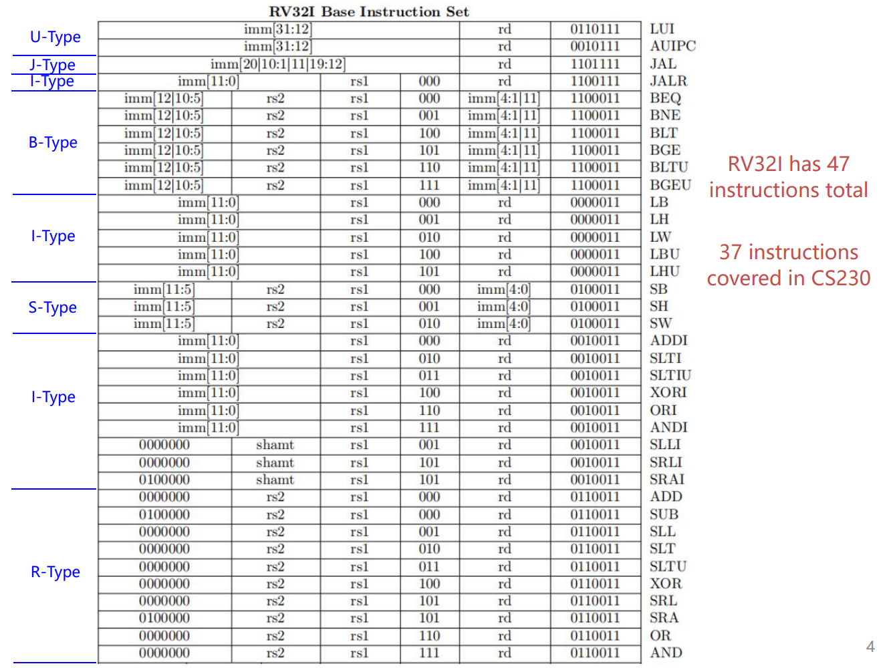
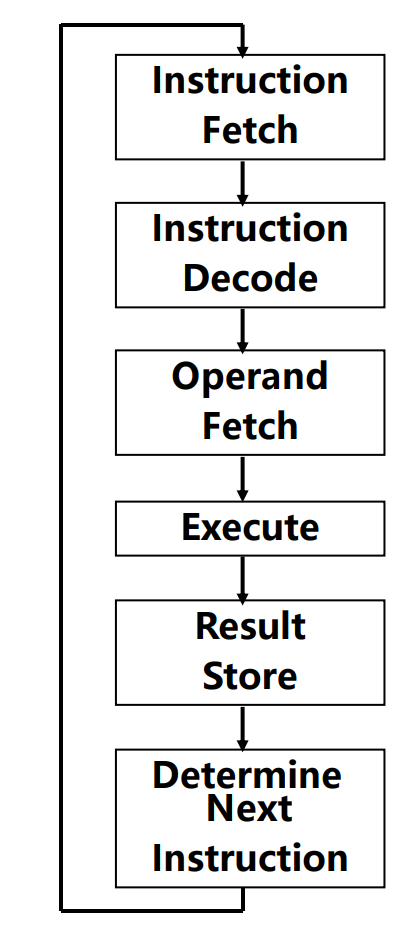
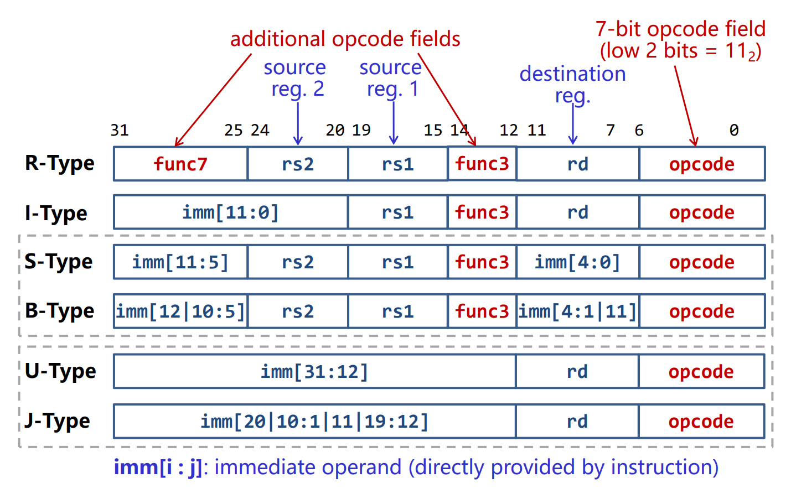
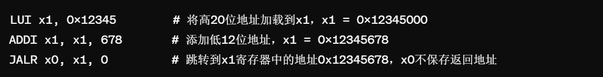
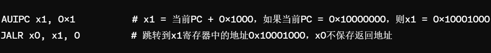



# L4: ISA(指令集架构)

**some images is captured from Macau University of Science and Technology CS230 course**

## Review:
In the past lectures, we have learned how to ***represent
data*** and perform concrete ***arithmetic
operations*** on data.
So the next problem is How to ***locate these data*** to
be processed, and how to tell the computer the ***concrete
operations*** to be applied on these data?
### Problem:
1.  **找到数据在哪**
2.  **"告诉"计算机对这些数据的具体操作**
## Concepts of ISA:
An instruction tells a computer to perform a specific operation, and it
comprises of multiple binary
fields.(根据前面的问题，一条指令需要有两个功能：1.
告诉计算机要进行的操作，2.要对哪些数据操作)
**Operands(操作数):** the data to be operated.
> -Source operands
>
> -Destination operands

**Opcodes(操作码):** the operation to be applied on the operand.
### An ISA (or architecture) includes:
1.  A set of instructions.
2.  A set of programmer visible properties (registers, memory addressing, memory model, I/O, interruption/exception)

### Three types of instruction:
1.  Computational 计算(Reg-Reg, also called ALU(arithmetic logic
    unit)instruction)
2.  Data movement 访存(e.g. load instruction(LW), store instruction(SW)
    ), **加载指令(load
    instruction)**将数据从内存传输到寄存器(register)中，由于**寄存器访问速度远快于内存**，因此通常在进行计算之前，需要先将数据加载到寄存器中。
3.  Control flow 控制流(e.g. Conditional branch, Unconditional jump,
    Procedure call/return),
    **控制流指令决定了程序中下一条指令执行的是什么。**它跳转到的目的地对应于另一个过程，在被调用过程(被调用者)完成时，它必须
    返回到调用过程(调用者).
    
### Program Counter(PC):
1.  A special register
2.  它是用于跟踪处理器正在执行的当前指令的位置
    在32位系统中，PC可以寻址2\^32个不同的字节地址，允许直接访问4GB的内存空间。而在64位系统中，它能访问的内存空间更多。
    在ISA的设计中，操作数的位置在各种指令格式中保持**一致性**。这意味着无论执行的是**算术指令**、**逻辑指令**还是其他类型的指令，指令中操作数的位置(即编码中的位字段)都是相同的。这种设计有两个主要好处:
      1.  Simplify circuit(简化电路，不需要对不同指令格式进行特殊处理来提取操作数)
      2.  Enable fetch easy
Instruction set:
    
## RISC-V
RISC-V是一种开发源代码的指令集架构(ISA)，是CS320课程使用的学习工具。
对于RV32I来说，只有32个32-bit的寄存器(RV64有32个64-bit的寄存器).
General Purpose Register(GPR)通用寄存器

### 程序执行的步骤:

1.  取指
2.  解码
3.  取操作数
4.  执行
5.  存储结果
6.  确定下一步指令

**RISC-V指令格式**

结合Instruction
set和RISC-V指令格式可以看出每个类型下具体操作的Opcode都是一样的(除了U-Type和J-Type，U-Type两个操作：LIU和AUIPC需要更多位立即数imm\[31:12\]，靠Opcode区分，J-Type只有JAL)，而其他类型的不同操作依靠func3区分(除了R-Type，func3只有3-bit，最多表示8个不同的操作，而R-Type有10个操作，所以需要额外一个func7(7-bit)区分)。
RISC-V指令有几种基本格式，每种格式都是为了满足不同类型操作的需求而设计。这些格式包括:
1.  R型: 用于寄存器间的算术和逻辑操作
    Reg-Reg操作，直接在寄存器之间进行数据处理，不涉及立即数或内存访问
    1.  **ADD:将两个寄存器的值相加。**
    2.  **SUB:从一个寄存器的值中减去另一个寄存器的值。**
    3.  **AND:执行两个寄存器值之间的位与(AND)操作。**
    4.  **OR:执行两个寄存器值之间的位或(OR)操作。**
    5.  **XOR:执行两个寄存器值之间的位异或(XOR)操作。**
    6.  **SLT(Set Less Than):如果一个寄存器中的值小于另一个寄存器中的值，则将1写入目的寄存器，否则写入0。**
        1.  **SLT rd, rs1, rs2**
            1.  **rs1 \< rs2 ? GPR(rd)=1 : GPR(rd)=0
                如果寄存器rs1中的值小于寄存器rs2中的值，那么目的寄存器rd被设置为1，否则设置为0。(均为有符号数比较)**
    7.  **SLL(Shift Left Logical):逻辑左移\*，将一个寄存器的值向左移动指定的位数，右边空出的位用0填充。**
2.  I型: 单个寄存器与立即数之间的操作
    1.  **JALR(Jump and Link Register):无条件跳转到由基址寄存器和立即数偏移量确定的地址，同时将下一条指令的地址保存到目的寄存器。常用于实现函数返回。**
        1.  **JALR rd, rs1, imm12**
            1.  **Target=GPR(rs1)+sign-extend(imm12)#计算跳转目标地址**
            2.  **Target&=0xFFFFFFFE#按位与(AND)操作清除目标地址最低位，确保地址按2的倍数对齐(地址对齐\***)
            3.  **GPR(rd)=PC+4#保存跳转指令的后一条指令**
            4.  **PC\<\--Target#实现无条件跳转**
    2.  **LB(Load Byte):从内存加载一个字节，并符号扩展到32位，然后存入目的寄存器。**
        1.  **LB rd, offset(rs1)]**
            1.  **MemoryAddress=GPR(rs1)+sign-extend(offset)**
            2.  **从计算出的MemoryAddress处加载一个字节。**
            3.  **将这个字节符号扩展到32位或64位(取决于寄存器的位宽)**
            4.  **最后，将扩展后的值存入目的寄存器rd中。**
    3.  **LH(Load Half-word):从内存加载半字(两个字节)，并符号扩展到32位，然后存入目的寄存器。**
    4.  **LBU(Load Byte Unsigned):从内存加载一个字节，但不进行符号扩展(即零扩展到32位)，然后存入目的寄存器。**
    5.  **LHU(Load Half-word Unsigned):从内存加载半字(两个字节)，但不进行符号扩展(即零扩展到32位)，然后存入目的寄存器。**
    6.  **SLTI(Set Less Than Immediate):将源寄存器的值与立即数比较，如果源寄存器的值小于立即数，则目的寄存器设为1，否则设为0。**
    7.  **SLTIU(Set Less Than Immediate Unsigned):无符号比较版本的SLTI，将源寄存器的值与进行符号位扩展后的立即数比较，比较时**均视为无符号数**。**
    8.  **XORI(XOR Immediate):执行源寄存器的值与立即数的异或(XOR)操作，并将结果(0/1)存入目的寄存器。**
    9.  **[ORI(OR Immediate):执行源寄存器的值与立即数的逻辑或操作，并将结果存入目的寄存器(rd)。**
    10. **SRLI(Shift Right Logical Immediate):将源寄存器的值逻辑右移指定的位数(由立即数给出)，并将结果存入目的寄存器。**
    11. **SRAI(Shift Right Arithmetic Immediate):将源寄存器的值算术右移指定的位数(由立即数给出)，并将结果存入目的寄存器。算术右移会保留符号位。**
    12. **LW(Load Word):从内存中加载一个字到寄存器。**
    13. **[ADDI(Add Immediate):将源寄存器的值与立即数相加。**
    14. **ANDI(AND Immediate):执行源寄存器的值与立即数的逻辑与操作。**
    15. **SLLl(Shift Left Logical Immdiate):将源寄存器的值向左逻辑移指定的位。**
    16. **CSR(Control and Status Register)访问指令:用于读取和修改控制和状态寄存器的值。控制和状态寄存器。**
3.  S型: 存储数据到内存
    S型操作的立即数需要重新组合，在其他的类型是rd(目标寄存器)的位置，S型操作在该位置是imm\[4:0\]，instr\[31:25\]是imm\[11:5\]。
    1.  **SB(Store Byte):存储一个字节到内存。**
    2.  **SH(Store Half word):存储半字(2字节)到内存。**
    3.  **SW(Store Word):存储一个字(4字节)到内存。**
4.  B型: 条件分支操作
    根据寄存器之间的比较结果来决定是否跳转到程序中的另一个位置。
    B-Type默认imm\[0\]=0
    1.  **BEQ(Branch if Equal):如果两个寄存器的值相等，则跳转。**
    2.  **BNE(Branch if Not Equal):如果两个寄存器的值不相等，则跳转。**
    3.  **BLT(Branch if Less Than)):如果第一个寄存器的值小于第二个寄存器的值(有符号比较)，则跳转。**
    4.  **BGE(Branch if Greater or Equal):如果第一个寄存器的值大于等于第二个寄存器的值(有符号比较)，则跳转。**
    5.  **BLTU(Branch if Less Than Unsigned):无符号比较版本的BLT。**
    6.  **BGEU(Branch if Greater or Equal Unsigned):无符号比较版本的BGE。**
5.  U型: 加载大的立即数到寄存器
    通过观察其他类型格式可以发现，U型指令将32位指令空间中的20位(imm\[31:12\])用于立即数，这使得它们可以用于构建大的常数或者作为跳转和其他指令的基地址。
    1.  **LIU:加载上位立即数:20位立即数，这部分立即数在执行LUI时直接加载到目标寄存器的高20位剩下的12位清零。**
    2.  **AUIPC:添加立即数到PC:将20位立即数左移12位(也就是说，将其作为高20位)，然后将结果加到当前PC值上，结果存储在目的寄存器中。**
6.  J型: 无条件跳转操作
    JAL指令格式中立即数(imm20)部分并非按照指令给定的顺序，具体顺序可见Instruction
    set
    1.  **JAL(Jump and Link):无条件跳转到程序指定的位置，同时将JAL的下一条指令保存到rd寄存器中。**
        1.  **JAL rd, imm21 imm21\[0\]=0**
            1.  **Target=PC+sign-extend(imm21)**
            2.  **GPR(rd)=PC+4**
            3.  **PC\<\--Target**
 每种格式都固定为32位长度，**不同之处在于操作码、寄存器地址和立即数字段的分配方式。**

 **逻辑移位与算术移位：**
 
 逻辑移位将二进制数的所有位向左或向右移动指定的位数，移入的位置用0填充。

 **逻辑左移(Shift Left Logical,SLL):** 
 
 向左移位时，最左边的位被移出，并且在最右边移入0。每向左移动一位，相当于乘以2。
 
 **逻辑右移(Shift Right Logical,SRL):** 
 
 向右移位时，最右边的位被移出，并且在最左边移入0。每向右移动一位，相当于除以2，但不保留余数。
 
 **算术左移(Shift Left Arithmetic,SLA):** 
 
 与逻辑左移相同，因为对于有符号数和无符号数而言左移的效果是一致的，即乘以2，最右边移入0。
 
 **算术右移(Shift Right Arithmetic,SRA):** 
 
向右移位时，最右边的位被移出，但最左边移入的是原来最左边的位的值(即符号位的值)，这保持了数的符号不变。对于负数(通常用补码表示)，这意味着在最左边移入1;对于正数，则移入0。
 
 **地址对齐：** 
 
 内存地址对齐是计算机在内存中的数据排列、访问数据的方式，包含了**基本数据对齐**和**结构体数据对齐**的两种相互独立又相互关联的部分。现代计算机在内存中读写数据是按**字节块**进行操作，理论上任意类型的变量访问可以从任何地址开始，但是计算机系统对任意数据类型在内存中存放位置有限，它会要求这些数据的首地址的值为K(4位或者8位)的整数倍。
 
  如在32位操作系统中，数据总线宽度32，每次读取4字节，地址总线宽度为32，故最大寻址空间为2\^32=4GB，但是最低位A\[0\]、A\[1\]不用寻址，A\[2\]、A\[3\]才能与存储器相连，总的寻址位还是2^30=4GB。在内存中存放的基本数据类型的首地址的最低两位都是0(结构体中的成员变量除外)。
  
  **基本类型数据对齐** 是数据在内存中的偏移地址必须为一个字的整数倍，这种存储数据的方式，可以提升系统在读取数据时的性能。
  在结构体中为了对齐数据，可能必须在上一个数据结束和下一个数据开始的地方填充一些不必要的字节。
  
 **Different Pairing with JALR**
 
 ***与LUI配合:***实现对任意32位绝对地址的跳转。
 ***与AUIPC配合:***实现对任意32位PC相对地址的跳转。
 
 **JALR与LUI指令配合使用：**
 LUI指令用于将一个20位的立即数加载到寄存器的高20位，同时将低12位置零。这允许我们设置寄存器中几乎任何32位值的高部分。
 当与JALR指令配合使用时，你首先可以使用LUI指令将目标地址的高20位设置到某个寄存器(比如rs1)，接着使用JALR指令，通过添加一个相对小的偏移量(12位立即数)，跳转到整个32位地址空间内几乎任意的绝对地址。这种方法允许程序跳转到32位地址空间内的任意位置。
 
 **JALR与AUIPC指令配合使用：**
   AUIPC指令用于将20位的立即数左移12位(形成高20位立即数)，加上当前PC值，结果存入指定寄存器。这样，我们可以得到一个相对于当前PC的偏移地址。当与JALR指令配合使用时，首先可以使用AUIPC指令计算出一个基于当前PC的偏移目标地址并将该地址存入寄存器。然后，通过JALR指令跳转到这个寄存器指定的地址，可以是程序内存空间内相对于当前PC的任意位置。这种方法适用于实现基于PC的相对跳转，特别是在处理大范围内的跳转时非常有效。
   
 举个例子：
 假设我们想要跳转到绝对地址0x12345678。这个地址超出了JALR指令直接指定的立即数偏移量范围，但我们可以先用LUI和一个立即操作来设置这个地址。

 首先使用LUI将目标地址的高20位加载到寄存器\`x1·中，然后使用ADDI指令添加剩余的低12位。最后，使用JALR指令无条件跳转到这个地址。
 
 假设我们现在的PC地址为0x10000000我们想要跳转到当前PC地址向前(或向后)某个偏移量的位置，例如0x10001000
 AUIPC指令将当前PC的值(假设为0x10000000)加上0x1000(因为立即数被左移了12位)，计算出新的地址并存入x1。然后，JALR指令使用x1寄存器的值作为跳转地址，实现了相对于当前PC的跳转。
